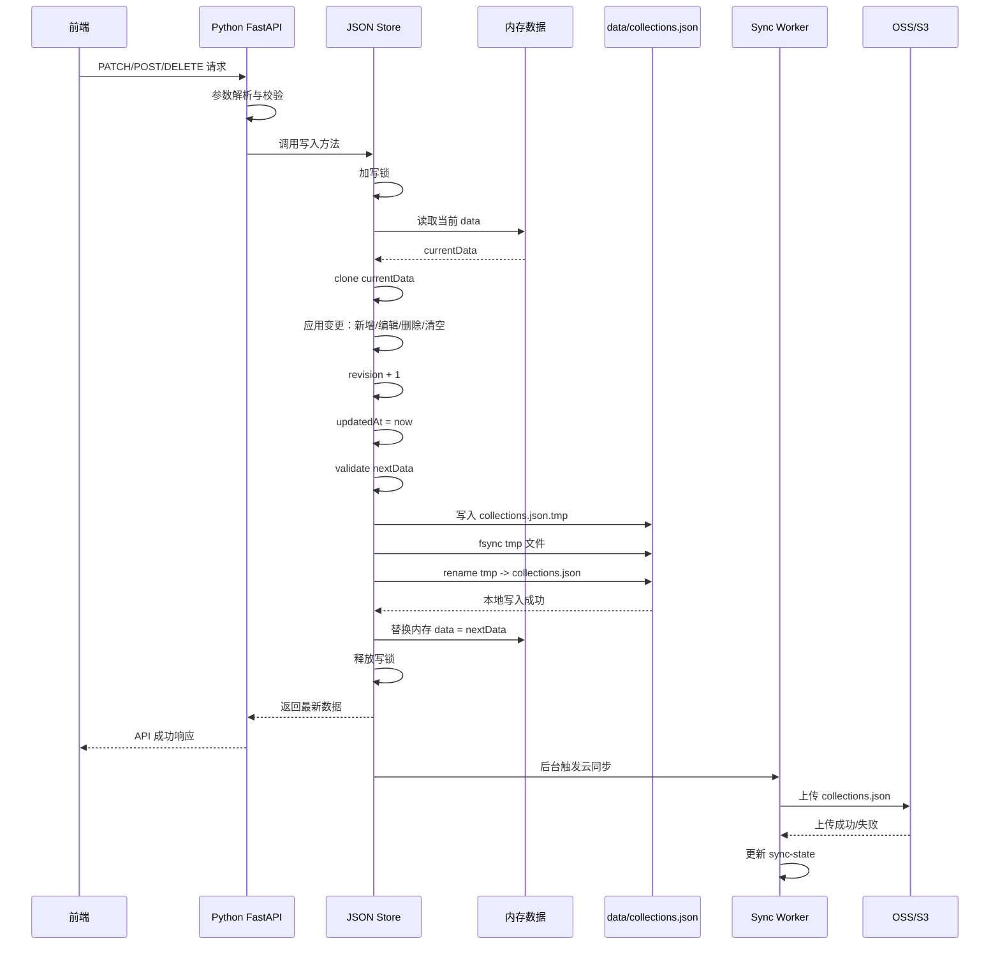
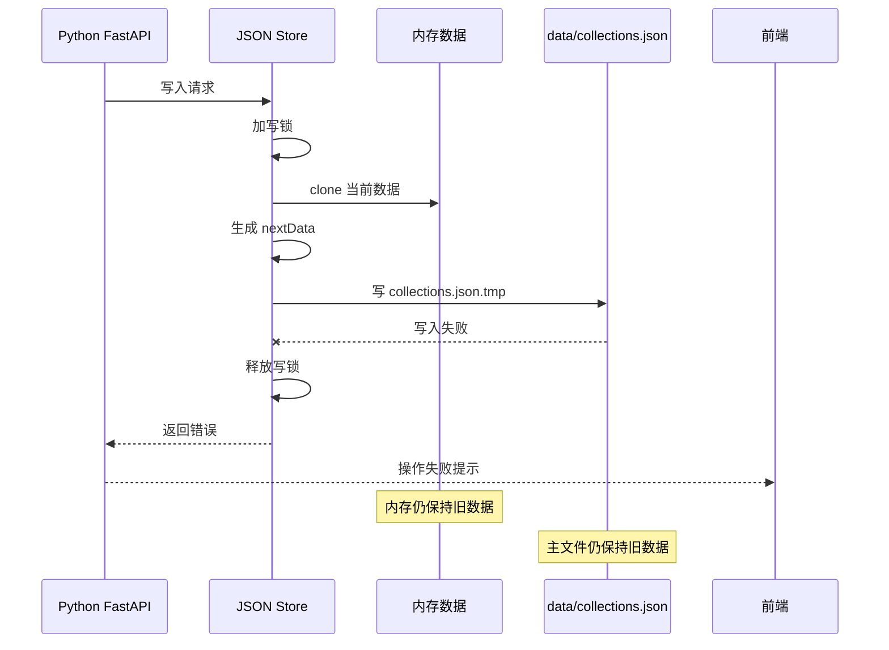
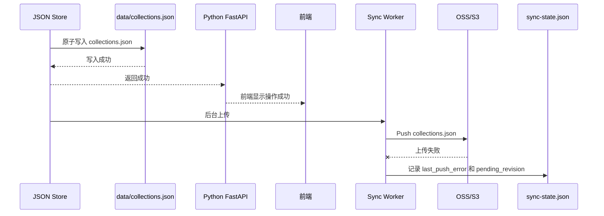

# OpenCollect 后端存储与云同步方案

更新日期：2026-05-27

## 结论

OpenCollect 当前目标后端采用：

```txt
Python + FastAPI + uvicorn
+ 本地 JSON Store
+ 可选 OSS/S3 云同步
+ REST API
+ 单实例部署
```

这个方案优先满足 PoC 阶段的几个目标：

- 成本极低，不依赖云数据库。
- 数据不再只存在浏览器 `localStorage`。
- 前端通过稳定 API 读写收藏，后续存储实现可替换。
- 支持把数据文件同步到 OSS、S3、Cloudflare R2 等对象存储。
- 使用 `uv` 管理虚拟环境、依赖和锁版本。

## P0 实施状态

截至 2026-05-27，P0 已按 Python FastAPI 方案落地：

- Python 服务入口：`backend/app/main.py`。
- Python API 路由：`backend/app/api/router.py`。
- Python 本地 JSON Store：`backend/app/store/`。
- Python 小红书解析：`backend/app/xhs/parser.py`。
- Python 图片和视频代理：`backend/app/media/proxy.py`。
- 前端 API 化和旧数据迁移：`public/app.js`。
- 示例数据结构：`docs/examples/collections.example.json`。
- 旧 Go 后端源码、Go module 和 Go 缓存已清理。

OSS/S3 云同步仍属于 P1，当前实现先使用本地 `data/collections.json`。

## 当前背景

当前 PoC 的后端是 Node.js 原生 `http` 服务，主要负责：

- 静态文件服务。
- 小红书链接解析。
- 图片代理：`GET /api/image`。
- 视频代理：`GET /api/media`。
- 收藏解析：`POST /api/collect`。

当前收藏主数据仍在浏览器 `localStorage`，这会带来：

- 换浏览器或清缓存后数据丢失。
- 无法做云端同步。
- 不适合批量导入和长期积累。
- 后续做用户系统、搜索、同步时需要重构。

## 目标

第一阶段目标不是做复杂后端，而是建立稳定的数据边界：

```txt
前端 UI
  |
  | REST API
  v
Python FastAPI 后端
  |
  | 本地读写
  v
data/collections.json
  |
  | 可选同步
  v
OSS/S3/R2
```

前端不再直接把收藏作为主数据写入 `localStorage`。`localStorage` 只用于迁移、临时 UI 状态或后续缓存。

## 非目标

第一阶段暂不做：

- MySQL、Postgres 等云数据库。
- 多实例并发写同一份对象存储文件。
- 用户账号系统。
- 小红书个人账号绑定导入。
- 媒体文件下载归档。
- 复杂全文搜索引擎。

## 技术选型

| 模块 | 选择 | 原因 |
| --- | --- | --- |
| 语言 | Python | 生态成熟；适合快速迭代抓取、解析和 API PoC |
| API 框架 | FastAPI | JSON API 开发快；类型校验清晰；自动 OpenAPI 文档 |
| 服务运行 | uvicorn | ASGI server，负责监听 HTTP 并运行 FastAPI app |
| 依赖管理 | uv | 管理虚拟环境、依赖解析、锁版本和命令运行 |
| 主存储 | 本地 JSON 文件 | 成本最低；PoC 足够；便于 OSS 同步 |
| 云同步 | S3-compatible 优先 | 可兼容 AWS S3、Cloudflare R2、部分 OSS/COS 兼容接口 |
| HTTP 客户端 | httpx | 支持同步/异步 HTTP、流式代理和 Range 透传 |
| 配置 | 环境变量 | 简单、部署友好 |
| 部署 | 单实例 Python 服务 | 避免对象存储写冲突 |

## 目录结构建议

当前选择 **单仓单服务，Python 后端托管静态前端**。

原因：

- 当前前端已经是 `public/` 下的静态页面。
- 后端职责明确：API、JSON Store、媒体代理、云同步。
- 部署简单：一个 `uvicorn` 进程即可托管前端和 API。
- 后续如果前端复杂化，可以再迁到前后端分离 Monorepo。

Python 后端目录：

```txt
backend/
  app/
    main.py
    api/
      router.py
    core/
      config.py
    store/
      json_store.py
      models.py
    xhs/
      parser.py
    media/
      proxy.py
  tests/

public/
  index.html
  app.js
  styles.css

data/
  collections.json
  sync-state.json

pyproject.toml
uv.lock
```

## 当前项目集成方式

当前项目根目录已经有：

```txt
public/
server.js
docs/
```

Python 服务集成方式：

```txt
server.js                         # 现有 Node PoC，保留作为参考基线
backend/app/main.py                # Python FastAPI 服务入口
backend/app/...                    # Python 后端实现
public/...                         # 继续复用现有前端静态文件
data/collections.json              # 后端主存储，本地生成，不提交真实数据
```

### 运行方式

Python 新服务：

```txt
uv sync
uv run uvicorn backend.app.main:app --host 127.0.0.1 --port 3002
```

Node 旧服务：

```txt
npm start
```

迁移期间端口建议：

- Node 旧服务：`3000`。
- Python 新服务：`3002`。
- 确认 Python 稳定后，再把 Python 切到默认端口。

建议配置：

```txt
PORT=3002
DATA_DIR=./data
PUBLIC_DIR=./public
SYNC_PROVIDER=none
```

### Python 服务接管顺序

按以下顺序接管：

1. 静态文件服务：Python 能打开 `public/index.html`、`app.js`、`styles.css`。
2. 收藏存储 API：`GET /api/collections` 等 CRUD API。
3. 本地 JSON Store 保持既有 schema 兼容。
4. 图片代理和视频代理迁移到 Python。
5. 小红书解析迁移到 Python。
6. 旧后端实现退为历史参考或清理。

### 静态文件服务规则

Python 服务应同时服务：

```txt
GET /                  -> public/index.html
GET /app.js            -> public/app.js
GET /styles.css        -> public/styles.css
GET /api/...           -> API 路由
```

API 路由优先于静态文件路由。未命中静态文件时，PoC 可以返回 `404`；如果后续做前端路由，再回退到 `index.html`。

### Python 依赖建议

P0 需要：

```txt
fastapi
uvicorn
httpx
pydantic
pytest
pytest-asyncio
```

P1 云同步再引入：

```txt
无需新增依赖，当前用 httpx + AWS Signature V4 直连 S3-compatible API
```

这样可以兼容腾讯云 COS 的 S3-compatible 接口，同时避免为了 PoC 引入较重的云厂商 SDK。

### Git 忽略建议

真实数据文件不要提交：

```txt
data/*.json
data/*.tmp
```

本地 Python 环境和缓存不要提交：

```txt
.venv/
.pytest_cache/
__pycache__/
*.pyc
```

可以提交示例：

```txt
data/.gitkeep
docs/examples/collections.example.json
```

## 数据文件结构

本地数据文件：

```txt
data/collections.json
```

建议结构：

```json
{
  "schemaVersion": 1,
  "revision": 1,
  "updatedAt": "2026-05-26T00:00:00.000Z",
  "collections": []
}
```

单条收藏结构：

```json
{
  "id": "internal-id-or-source-id",
  "platform": "xiaohongshu",
  "sourceId": "xhs-note-id",
  "sourceUrl": "https://www.xiaohongshu.com/explore/...",
  "canonicalUrl": "https://www.xiaohongshu.com/explore/...",
  "type": "normal",
  "title": "笔记标题",
  "content": "笔记正文",
  "author": {
    "id": "author-id",
    "name": "作者名",
    "avatar": "https://..."
  },
  "images": [
    {
      "url": "https://...",
      "width": 1080,
      "height": 1440,
      "livePhoto": false
    }
  ],
  "video": {
    "url": "https://sns-video-qc.xhscdn.com/...",
    "poster": "https://sns-img-qc.xhscdn.com/...",
    "width": 1080,
    "height": 1920,
    "duration": 15,
    "format": "mp4",
    "codec": "h264"
  },
  "tags": ["标签"],
  "stats": {
    "likes": "0",
    "collects": "0",
    "comments": "0",
    "shares": "0"
  },
  "sourceCreatedAt": "",
  "sourceUpdatedAt": "",
  "collectedAt": "2026-05-26T00:00:00.000Z",
  "updatedAt": "2026-05-26T00:00:00.000Z",
  "deletedAt": ""
}
```

说明：

- 媒体字段只保存原始 URL 和元数据，不默认下载图片或视频；视频播放优先使用平台返回的分发 URL。
- 小红书 Web 端已不稳定返回 `originVideoKey`，当前方案不再采集或输出该字段；视频能力保存平台返回的结构化 `streams[]` 候选流和 `bizId`。
- `deletedAt` 预留给软删除。PoC 第一版可以物理删除。
- `revision` 每次写入递增，用于同步和排查覆盖问题。

## 本地 JSON Store 职责

`store.JsonStore` 负责：

- 启动时加载 `data/collections.json`。
- 文件不存在时初始化空数据。
- 文件损坏时返回明确错误，后续可从备份恢复。
- 内存中维护当前数据。
- 用 `sync.RWMutex` 保护并发读写。
- 写入时先写 `.tmp` 文件，再原子替换。
- 每次写入递增 `revision`，更新 `updatedAt`。

写入流程：

```txt
API 请求
  -> 参数校验
  -> store 加锁
  -> 修改内存数据
  -> marshal JSON
  -> 写 collections.json.tmp
  -> rename tmp -> collections.json
  -> store 解锁
  -> 触发云同步
```

### 写入时序图

通用写入流程适用于新增、编辑、删除和清空收藏。



本地写入失败时，API 应返回失败，内存和主文件都保持旧数据。



云同步失败不应导致本地操作失败，只记录同步状态，供后续重试或展示。



## 云同步职责

同步模块抽象为：

```python
class Syncer(Protocol):
    async def pull(self) -> bytes: ...
    async def push(self, data: bytes) -> None: ...
    async def backup(self, data: bytes) -> None: ...
```

第一版实现：

- `NoopSyncer`：不开启云同步，只用本地文件。
- `S3Syncer`：兼容 S3/R2/部分 OSS S3-compatible API。

启动流程：

```txt
服务启动
  -> 如果 SYNC_PROVIDER=none，读取本地文件
  -> 如果 SYNC_PROVIDER=s3，先尝试从云端拉取 collections.json
  -> 下载成功：覆盖本地 data/collections.json
  -> 下载失败但本地存在：使用本地文件启动，并记录警告
  -> 两者都不存在：初始化空文件
```

写入同步流程：

```txt
本地写入成功
  -> 写入 data/collections.json
  -> revision 递增
  -> sync-state.json 标记 dirty=true
  -> 等待用户点击“保存并上传”
```

PoC 当前固定使用“手动保存并上传”，不保留写后自动上传模式。这样可以避免每次编辑、删除、撤销都立刻覆盖云端，也便于用户在批量整理后统一上传。

## 手动保存并上传规划

云同步固定为手动上传，不提供 `auto` 模式开关。

手动模式下，本地仍然是运行时主存储：

```txt
新增/编辑/删除/清空
  -> 立即写入 data/collections.json
  -> revision 递增
  -> sync-state.json 标记 dirty=true、pending_revision=当前 revision
  -> 不自动上传 COS

用户点击“保存并上传”
  -> 上传备份到 opencollect/backups/
  -> 上传主文件到 opencollect/collections.json
  -> 上传成功后 dirty=false、last_pushed_revision=当前 revision
```

第一版交互：

- 页面顶部展示同步状态：`已同步`、`有本地更改`、`上传中`、`上传失败`。
- 增加“保存并上传”按钮，只有有本地更改或上次上传失败时突出显示。
- 存在未上传更改时，刷新、关闭、离开页面触发 `beforeunload` 提示。
- 同浏览器多页面通过 `BroadcastChannel` 广播 `collections-updated` 和 `sync-state-updated`，让其他页面自动刷新。

多页面第一版处理：

- 后端仍是唯一真源，多页面共享同一个 `data/collections.json`。
- 保存并上传始终上传后端当前最新 JSON，不上传某个页面内存里的旧副本。
- `BroadcastChannel` 负责让其他页面及时刷新，减少旧 UI 误操作。

未来优化：

- 前端写操作携带 `baseRevision`，后端对编辑、删除、清空做 revision 校验。
- 旧页面提交时返回 `409 CONFLICT`，前端自动拉取最新数据并提示用户重新确认。
- 上传前校验云端 revision 是否已经变化，避免多设备或其他实例覆盖云端新数据。
- 需要时支持集合级合并：本地新增和云端新增自动合并，同一条编辑冲突保留冲突副本。
- 批量导入时可增加 debounce 合并上传或一次导入结束后统一上传。

### 手动上传验收标准

后端：

- 写后只标记 dirty，不自动上传。
- `GET /api/sync/status` 返回 `dirty`、`pending_revision`、`last_pushed_revision`、`last_local_change_at`。
- `POST /api/sync/push` 执行备份和主文件上传。
- 上传成功后清除 dirty；上传失败后保留 dirty 和错误原因。
- `/api/sync/status` 和 `/api/sync/push` 响应不暴露云存储密钥。

前端：

- 页面首次加载展示同步状态。
- 本地变更后展示“有本地更改”，并突出“保存并上传”。
- 上传过程中展示“上传中”，成功后展示“已同步”，失败后展示“上传失败”。
- dirty 状态下注册 `beforeunload` 离开提示。
- 同浏览器多标签页通过 `BroadcastChannel` 同步刷新列表和同步状态。

真实 COS 回归：

- 手动模式下，本地变更不会立即更新 COS `collections.json`。
- 点击“保存并上传”后，COS 主文件 revision 更新，并生成备份对象。
- 上传失败时，本地 `collections.json` 保持最新，COS 不被错误覆盖。

## 对象存储路径建议

```txt
opencollect/
  collections.json
  backups/
    collections-2026-05-26T10-30-00Z.json
```

## 配置项

本地开发时，后端会自动读取项目根目录 `.env`。系统环境变量优先级更高，`.env` 不会覆盖已经存在的环境变量。

```txt
PORT=3000
DATA_DIR=./data

SYNC_PROVIDER=none

S3_ENDPOINT=
S3_REGION=auto
S3_BUCKET=
S3_ACCESS_KEY_ID=
S3_SECRET_ACCESS_KEY=
S3_OBJECT_KEY=opencollect/collections.json
S3_BACKUP_PREFIX=opencollect/backups/
S3_FORCE_PATH_STYLE=true
```

腾讯云 COS 建议配置：

```txt
SYNC_PROVIDER=cos
COS_ENDPOINT=https://cos.<region>.myqcloud.com
COS_REGION=<region>
COS_BUCKET=<bucket>-<appid>
COS_SECRET_ID=<secret-id>
COS_SECRET_KEY=<secret-key>
COS_OBJECT_KEY=opencollect/collections.json
COS_BACKUP_PREFIX=opencollect/backups/
COS_FORCE_PATH_STYLE=false
```

说明：

- 前端不能持有对象存储 AccessKey。
- 所有云存储写权限只放在后端环境变量中。
- 当前实现支持 `SYNC_PROVIDER=s3` 和 `SYNC_PROVIDER=cos`，两者都走 S3-compatible API。
- 腾讯云 COS 桶名需要填写完整名称，通常包含 APPID，例如 `<bucket>-1250000000`。
- 腾讯云 COS Endpoint 可以使用区域根节点，例如广州区域是 `https://cos.ap-guangzhou.myqcloud.com`；也可以使用 Bucket 专属域名，例如 `https://<bucket>-<appid>.cos.<region>.myqcloud.com`。
- 腾讯云 COS 新桶优先使用 virtual-hosted-style，因此 `SYNC_PROVIDER=cos` 时默认 `COS_FORCE_PATH_STYLE=false`。
- 代码也兼容通用 `S3_*` 配置；`COS_*` 只是腾讯云命名习惯的别名。

## API 设计

第一版 API：

```txt
GET    /api/collections
GET    /api/collections/:id
POST   /api/collect
PATCH  /api/collections/:id
POST   /api/collections/:id/refresh
DELETE /api/collections/:id
DELETE /api/collections
POST   /api/collections/import-local
GET    /api/image?url=...
GET    /api/media?url=...
GET    /api/sync/status
POST   /api/sync/push
POST   /api/sync/retry
```

### GET /api/sync/status

返回当前同步状态，不包含任何 AccessKey 或 SecretKey：

```json
{
  "provider": "cos",
  "enabled": true,
  "status": "synced",
  "object_key": "opencollect/collections.json",
  "last_pushed_revision": 12,
  "pending_revision": 0,
  "last_error": ""
}
```

### POST /api/sync/push

把当前本地 `collections.json` 上传到对象存储。上传前会先写一份备份对象到 `backups/`。

### POST /api/sync/retry

兼容旧入口，行为与 `POST /api/sync/push` 一致。

### GET /api/collections

返回收藏列表。

可选查询参数：

```txt
platform=xiaohongshu
type=normal|video
q=关键词
```

第一版可以先只返回全部，搜索筛选放到 P2。

### POST /api/collect

请求：

```json
{
  "input": "小红书分享文本或链接"
}
```

流程：

```txt
识别链接
  -> 解析小红书详情
  -> 标准化 note
  -> upsert 到 JSON Store
  -> 如果已启用同步，则标记 dirty，等待用户手动上传
  -> 返回收藏对象
```

### PATCH /api/collections/:id

用于编辑标题、正文、标签、原文链接等用户可编辑字段。

### DELETE /api/collections/:id

删除单条收藏。

PoC 第一版可以物理删除。若需要更强撤销，可改为软删除。

### DELETE /api/collections

清空全部收藏。

### POST /api/collections/import-local

用于把旧 `localStorage` 数据迁移到后端。

请求：

```json
{
  "collections": []
}
```

后端负责去重、补默认字段、写入 JSON Store。

## 前端迁移策略

当前前端仍使用 `localStorage`。迁移后：

```txt
页面启动
  -> GET /api/collections
  -> 如果后端为空且 localStorage 有旧数据
  -> POST /api/collections/import-local
  -> 成功后设置 opencollect:migrated:v1=true
```

前端内存仍可保留 `notes` 数组用于渲染，但主数据源变为后端 API。

编辑、删除、清空、撤销：

- 编辑：`PATCH /api/collections/:id`
- 删除：`DELETE /api/collections/:id`
- 清空：`DELETE /api/collections`
- 撤销：PoC 第一版可以前端持有被删除数据，再调用导入/恢复 API

## 小红书解析迁移策略

这是从旧后端迁移到 Python 的最大不确定点。

建议分阶段：

1. Python 后端先实现静态文件服务、JSON Store、收藏 CRUD API。
2. 小红书解析保留旧实现的行为作为迁移参考。
3. 迁移 Python 版解析时，重点处理 `window.__INITIAL_STATE__` 的提取和结构解析。
4. 媒体代理迁移到 Python，重点验证 Range 透传和流式响应。

如果希望替换旧后端，则 Python 版必须同时实现：

- 小红书链接识别。
- 短链跳转解析。
- SSR 数据提取。
- 笔记详情标准化。
- 图片代理。
- 视频 Range 代理。

## 风险和应对

| 风险 | 影响 | 应对 |
| --- | --- | --- |
| JSON 文件被写坏 | 数据不可读 | `.tmp` 原子写；写前/写后校验；保留备份 |
| 多实例同时写 OSS | 数据覆盖 | 第一阶段只支持单实例；后续引入 ETag/revision 冲突检测 |
| OSS 上传失败 | 云端不是最新 | 本地写入仍成功；记录同步失败；提供手动重试 |
| JSON 文件变大 | 读写变慢 | PoC 可接受；后续拆分文件或迁 SQLite/Postgres |
| 小红书页面结构变化 | 解析失败 | 错误分层；保留重新抓取；记录失败原因 |
| AccessKey 泄露 | 云端数据风险 | 只放后端环境变量；前端永不直连 OSS 写接口 |

## 验收标准

验收分为 P0 和 P1。P0 先验收本地后端存储，P1 再验收云同步。

### P0：Python FastAPI + JSON Store + 收藏 API

P0 完成后，应满足：

- [x] `AC-P0-001` 可以通过 `uv run uvicorn backend.app.main:app --host 127.0.0.1 --port 3002` 启动 Python 服务。
- [x] `AC-P0-002` Python 服务可以正常托管 `public/index.html`、`public/app.js`、`public/styles.css`。
- [x] `AC-P0-003` 首次启动时，如果 `data/collections.json` 不存在，会初始化合法空文件。
- [x] `AC-P0-004` `data/collections.json` 符合 `schemaVersion`、`revision`、`updatedAt`、`collections` 结构。
- [x] `AC-P0-005` 新增、编辑、删除、清空都会写入 `data/collections.json`。
- [x] `AC-P0-006` 每次变更后 `revision` 递增，`updatedAt` 更新。
- [x] `AC-P0-007` 写入使用 `.tmp` 文件和原子替换，不直接覆盖主文件。
- [x] `AC-P0-008` `GET /api/collections` 返回当前收藏列表。
- [x] `AC-P0-009` `GET /api/collections/:id` 返回指定收藏。
- [x] `AC-P0-010` `POST /api/collections/import-local` 能导入旧 `localStorage` 收藏，并做基础去重。
- [x] `AC-P0-011` `PATCH /api/collections/:id` 能编辑标题、正文、标签、原文链接等字段。
- [x] `AC-P0-012` `DELETE /api/collections/:id` 能删除单条收藏。
- [x] `AC-P0-013` `DELETE /api/collections` 能清空全部收藏。
- [x] `AC-P0-014` 前端页面加载收藏来自 `GET /api/collections`，不再以 `localStorage` 为主存储。
- [x] `AC-P0-015` `/api/sample` 可以返回多图小红书示例。
- [x] `AC-P0-016` `/api/collect` 可以实际解析小红书示例并写入收藏。
- [x] `AC-P0-017` 旧 Go 后端源码、Go module 和 Go 缓存已清理。
- [x] `AC-P0-018` 当前已有体验不退化：瀑布流、详情、多图、视频、编辑、删除、清空、撤销、平台角标正常。

P0 的最低可接受状态：

```txt
Python 服务可以托管前端和收藏 CRUD。
收藏数据主存储从 localStorage 迁到 data/collections.json。
```

### P1：OSS/S3 云同步

P1 完成后，应满足：

- [x] `AC-P1-001` `SYNC_PROVIDER=none` 时不需要云配置，本地模式可正常启动和读写。
- [x] `AC-P1-002` `SYNC_PROVIDER=s3/cos` 时，服务启动会尝试从对象存储拉取 `collections.json`。
- [x] `AC-P1-003` 云端存在合法 `collections.json` 时，会下载并覆盖本地数据文件。
- [x] `AC-P1-004` 云端不存在数据文件、本地也不存在时，会初始化空文件。
- [x] `AC-P1-005` 云端拉取失败但本地文件存在时，服务可使用本地文件启动，并记录同步失败原因。
- [x] `AC-P1-006` 新增、编辑、删除、清空后，本地 JSON 更新，并上传最新文件到对象存储。
- [x] `AC-P1-007` 上传前或上传时，会在 `backups/` 前缀下生成备份文件。
- [x] `AC-P1-008` 上传失败时，本地写入仍成功，API 响应、同步状态和日志能看到同步失败原因。
- [x] `AC-P1-009` S3/COS AccessKey 只从后端环境变量读取，前端代码和接口响应不暴露密钥。
- [x] `AC-P1-010` 单实例部署下，不会出现本地 revision 回退或云端文件被旧数据覆盖。

P1 的最低可接受状态：

```txt
对象存储作为 collections.json 的低成本云端同步和备份位置。
本地 JSON 仍是运行时主存储。
```

## 实施计划

下一轮：

- [x] `OC-P1-001` 抽象 `Syncer` 接口。
- [x] `OC-P1-002` 实现 `NoopSyncer`。
- [x] `OC-P1-003` 实现 S3-compatible `S3Syncer`，并支持 `SYNC_PROVIDER=cos`。
- [x] `OC-P1-004` 启动时从对象存储拉取。
- [x] `OC-P1-005` 写入后上传对象存储。
- [x] `OC-P1-006` 上传前生成云端备份。
- [x] `OC-P1-007` 记录同步状态和失败原因。
- [x] `OC-P1-008` 使用真实腾讯云 COS Bucket 做端到端验证。

## 最终判断

这个方案牺牲了数据库的强查询能力，但换来最低成本和最快可落地的云同步能力。对当前 PoC 来说是合理的。

后续如果收藏数量、查询复杂度或多用户需求上来，可以平滑迁移：

```txt
JSON Store -> SQLite -> Postgres/MySQL
```

由于前端只依赖 REST API，存储层替换不会要求前端大改。
